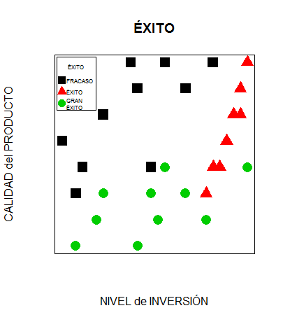
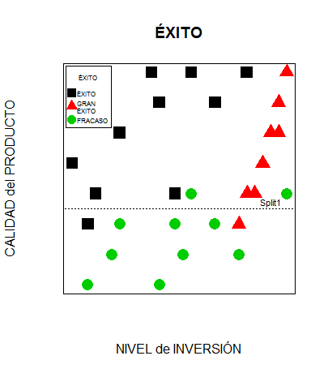

```{r setup, include=FALSE}
knitr::opts_chunk$set(echo = TRUE, message = FALSE, warning = FALSE)
```

Los **Árboles de Decisión** o **Clasificación** constituyen un buen ejemplo de clasificadores *Machine Learning*. Son relativamente sencillos de entender y sobre ellos se basan otros algoritmos más complicados.

## ¿A qué problemas se aplican?

El escenario es el siguiente: tenemos una serie de *observaciones* o *ejemplos*. Cada uno de ellos está compuesto por un vector de valores concretos de diferentes variables:

-   Variables *predictoras*, *atributos* o *features*: pueden ser **continuas** o **categóricas**.

```{=html}
<!-- -->
```
-   Variable ***target*** o ***label***: una variable **categórica** que explicita la clase a la que pertenece cada ejemplo.

(**Nota**: una variable continua es una variable que puede tomar valores numéricos de tipo real; una variable categórica toma valores discretos. Puede ser binaria - dos valores discretos - o tener más niveles).

Pongamos un **ejemplo**. Supongamos que hemos ido reuniendo datos sobre nuevas empresas creadas recientemente (por ejemplo, en el último año). Sobre cada una de ellas hemos registrado el nivel de calidad de su poducto (MEDIO, ALTO, SOBRESALIENTE) y el nivel de inversión realizado (MODERADO, ALTO, MUY ALTO). Registramos también el éxito que han tenido (FRACASO, ÉXITO, GRAN ÉXITO). Nos quedaría una tabla como la siguiente:

    ##    INVERSIÓN       CALIDAD      ÉXITO
    ## 1   MODERADO SOBRESALIENTE      ÉXITO
    ## 2   MODERADO          ALTO      ÉXITO
    ## 3   MODERADO SOBRESALIENTE      ÉXITO
    ## 4       ALTO SOBRESALIENTE      ÉXITO
    ## 5       ALTO SOBRESALIENTE      ÉXITO
    ## 6       ALTO SOBRESALIENTE      ÉXITO
    ## 7       ALTO SOBRESALIENTE      ÉXITO
    ## 8   MUY ALTO SOBRESALIENTE      ÉXITO
    ## 9   MUY ALTO SOBRESALIENTE      ÉXITO
    ## 10  MUY ALTO SOBRESALIENTE      ÉXITO
    ## 11  MUY ALTO          ALTO GRAN ÉXITO
    ## 12  MUY ALTO SOBRESALIENTE GRAN ÉXITO
    ## 13  MUY ALTO SOBRESALIENTE GRAN ÉXITO
    ## 14  MUY ALTO SOBRESALIENTE GRAN ÉXITO
    ## 15  MUY ALTO SOBRESALIENTE GRAN ÉXITO
    ## 16  MUY ALTO SOBRESALIENTE GRAN ÉXITO
    ## 17  MUY ALTO SOBRESALIENTE GRAN ÉXITO
    ## 18  MUY ALTO SOBRESALIENTE GRAN ÉXITO
    ## 19  MUY ALTO SOBRESALIENTE GRAN ÉXITO
    ## 20  MUY ALTO SOBRESALIENTE GRAN ÉXITO
    ## 21  MODERADO         MEDIO    FRACASO
    ## 22      ALTO          ALTO    FRACASO
    ## 23      ALTO          ALTO    FRACASO
    ## 24      ALTO         MEDIO    FRACASO
    ## 25      ALTO          ALTO    FRACASO
    ## 26      ALTO          ALTO    FRACASO
    ## 27  MUY ALTO SOBRESALIENTE    FRACASO
    ## 28  MUY ALTO          ALTO    FRACASO
    ## 29  MUY ALTO          ALTO    FRACASO
    ## 30  MUY ALTO SOBRESALIENTE    FRACASO

Tenemos dos atributos categóricos (cada uno con tres niveles) y una variable objetivo categórica y binaria.

Gráficamente podemos expresarlo así:

<center>

<!-- [](http://es100x100datascience.com/wp-content/uploads/2015/09/Éxito.png) -->



</center>

La pregunta que nos planteamos es: a la hora de valorar un nuevo proyecto de inversión ¿seremos capaces de predecir su éxito a partir de la calificación que el nuevo proyecto obtenga en cuanto a nivel de inversión y calidad del producto?

Nivel de inversión y calidad del producto serían nuestras features o predictores y Éxito sería nuestra variable target.

Los árboles de decisión se emplean para realizar este tipo de predicciones. Veamos un ejemplo de árbol:

<center>

<!-- [](http://es100x100datascience.com/wp-content/uploads/2015/09/Decission_Tree_Example.jpg) -->


</center>

El nodo raíz, donde comienza el árbol, es Does it move?. La decisión va pasando por los diferentes nodos de decisión, que requieren que vayamos realizando elecciones según los atributos de cada ejemplo, hasta llegar a un nodo hoja, que representa la decisión a la que nos ha conducido el árbol de decisión.

## Divide y vencerás

Los árboles de decisión se construyen utilizando una estrategia llamada particionamiento recursivo, también conocida como divide y vencerás: va dividiendo los datos en grupos cada vez menores hasta que el proceso se detenga debido a que los datos en cada grupo ya son suficientemente homogéneos u a otros criterios que veremos a continuación.

Al inicio del proceso tenemos un único nodo al que pertenecen todos los ejemplos de nuestros datos. A continuación, el algoritmo escoge un atributo como criterio para realizar la primera partición; idealmente, escogerá aquel atributo que prediga mejor la variable objetivo. Los ejemplos del primer nodo se dividirán entonces en grupos según los distintos valores del atributo escogido, lo que dará lugar a los nodos-hijo de primer nivel y sus correspondientes ramas.

El proceso se repite recursivamente con cada nuevo nodo, dividiéndolo de la manera explicada hasta que:

-   Todos (o casi todos) los ejemplos del nodo sean de la misma clase.

```{=html}
<!-- -->
```
-   No queden atributos con los que continuar el particionamiento.

```{=html}
<!-- -->
```
-   El árbol haya alcanzado un tamaño predefinido.

 

## Volviendo a nuestro ejemplo

Mediante esta estrategia podemos construir un sencillo árbol de decisión con nuestros datos.

Al principio todos nuestros ejemplos están en el nodo raíz. Para crear la primera partición podemos escoger el atributo CALIDAD, dividiendo las empresas emprendedoras entre aquellas con CALIDAD media y calidad ALTA o SOBRESALIENTE:

<center>

<!-- [](http://es100x100datascience.com/wp-content/uploads/2015/09/Split1.png) -->


</center>

A continuación podemos dividir el grupo de empresas con productos de CALIDAD ALTA o SOBRESALIENTE según si su nivel de INVERSIÓN es MUY ALTA o solo ALTA o MEDIA:

<center>

<!-- [](http://es100x100datascience.com/wp-content/uploads/2015/09/Split2.png) -->


</center>
Con esto tenemos divididos los ejemplos de nuestros datos en tres grupos:

-   El de abajo (CALIDAD de producto MEDIA) contiene las empresas que han fracasado más una empresa con ÉXITO y otra con GRAN ÉXITO.

```{=html}
<!-- -->
```
-   El de arriba a la derecha (CALIDAD DE PRODUCTO ALTA o SOBRESALIENTE y nivel de INVERSIÓN MUY ALTO) contiene a las empresas que han alcanzado GRAN ÉXITO, más una sólo con ÉXITO y otra con FRACASO.

```{=html}
<!-- -->
```
-   El de arriba a la izquierda (CALIDAD DE PRODUCTO ALTA o SOBRESALIENTE y nivel de INVERSIÓN MODERADO o ALTO) contiene a las empresas que han alcanzado el ÉXITO, más una con FRACASO.

En resumen, con este sencillo árbol de decisión:

-   Si el nivel de CALIDAD del producto es MEDIO => FRACASO

```{=html}
<!-- -->
```
-   Si el nivel de CALIDAD del producto es ALTO o SOBRESALIENTE

    -   Si el nivel de INVERSIÓN es MUY ALTO => GRAN ÉXITO

    -   Si el nivel de INVERSIÓN es MODERADO o ALTO => ÉXITO

hemos clasificado correctamente 25 de las 30 empresas que contenían nuestros datos.

En el [siguiente artículo](/2015/11/03/arboles-de-decision-ii/) veremos cómo crear árboles de decisión con R.
