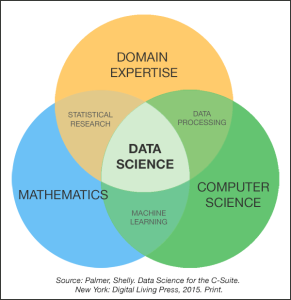

"Data Science". ¿Una expresión "de moda? ¿En qué consiste?

Los seres vivos percibimos **estímulos** de nuestro entorno -- externo e interno -- y **respondemos** a ellos.

La mayoría de ellos responden a los estímulos de forma automática. Al menos los seres humanos somos capaces de inhibir la respuesta automática y elaborar una respuesta consciente. Los estímulos son **datos** que contienen **información**. De la respuesta, automática o elaborada, depende nuestra supervivencia y nuestra reproducción. Así que ya desde este nivel básico, biológico y evolutivo, los datos y la información que contienen son vitales.

Los seres humanos desarrollamos también la capacidad de comunicar a nuestros semejantes y solicitar de ellos los datos percibidos y la información que creemos que contienen: inventamos el lenguaje. Esta actividad social probablemente condujo también a la capacidad de dialogar con nosotros mismos, de **preguntarnos** a nosotros mismos.

Según nuestras sociedades se fueron haciendo más complejas en la Revolución Neolítica, también se complicaron las necesidades de supervivencia y reproducción. ¿Tenemos provisiones para sobrevivir al invierno? ¿Cuántos impuestos recaudamos el año pasado y cuántos recaudaremos este año? ¿Serán suficientes para mantener las campañas guerreras o la construcción de la pirámide? ¿Qué dicen los astros sobre el destino del nuevo príncipe?

Empezamos a inventar métodos para poder responder a estas nuevas preguntas: los números y las operaciones básicas -- con lo que por primera vez los datos se hicieron **cuantitativos**; y nuevas tecnologías para almacenar datos e información. Hasta entonces sólo nuestros cerebros mantenían la memoria de estos datos e informaciones, transmitidos por tradición oral de generación en generación. La invención de la escritura y la disponibilidad de nuevos soporte físicos -- las tablillas de arcilla, el papiro, el papel -- permitieron descargar y ampliar nuestra memoria, preservándolos también en el tiempo. Las relaciones intelectuales aumentaron en culturas como la griega, en la que podemos decir que nación la **Ciencia**. Fue la primera Revolución de la Información, potenciada posteriormente por la invención de la imprenta.

Continuamos haciéndonos preguntas, a escala social e individual. A partir del Renacimiento la Ciencia florece en Occidente, apoyándose en avances previos -- árabes, indios -- en las Matemáticas.  Galileo, Copérnico, Kepler, Newton empiezan a intentar responder preguntas utilizando un **método científico**. Y utilizan las Matemáticas tanto para establecer sus hipótesis como para realizar predicciones cuantitativas a partir de ellas, lo que les permite corroborarlas o rechazarlas: obtienen datos cuantitativos de la observación y experimentación y los contrastan con los predichos por sus hipótesis.

El nuevo método tiene éxito, mucho éxito. Las Ciencias florecen: la Física, la Química, la Biología. Empiezan a aplicarse también en nuevas técnicas y tecnologías, la Ingeniería se desarrolla. Y eso nos conduce a una nueva Revolución, la Industrial. Para todo ello se desarrolla toda una nueva rama de las Matemáticas: la [Estadística](https://es.wikipedia.org/wiki/Estad%C3%ADstica).

Si, el nuevo método tiene mucho éxito. La Medicina se desarrolla y se aplica también a Ciencias Sociales: Psicología, Sociología, Antropología, Economía. Es un éxito rotundo. En todas ellas buscamos datos experimentales que nos permitan corroborar o rechazar nuestras hipótesis. Los datos y la información se han convertido ya en **conocimiento**.

Y todo este conocimiento, teórico y aplicado, crece, se expande. En el siglo XX los avances en Matemáticas y Física nos conducen a inventar el ordenador e Internet. Una nueva Revolución de la Información ha nacido. Con ella los datos creados por humanos crecen a mayor velocidad que los extraídos de la Naturaleza. Nuestra capacidad de almacenar, procesar y comunicar datos, información y conocimiento asciende a otra división, crece exponencialmente según la [**Ley de Moore**](https://es.wikipedia.org/wiki/Ley_de_Moore): aproximadamente cada dos años se duplica el número de transistores en un circuito integrado: desde los años 80 la velocidad de los microprocesadores se ha multiplicado por 360; pero es que el precio del almacenamiento ha bajado de 1 000 \$  por megabyte a  25 \$ por gigabyte! Es 40 000 veces más barato... No sólo eso: los primeros discos con capacidad para gigabytes pesaban en torno a 130 kilos; hoy, una micro SD con capacidad para 32 gigabytes pesa medio gramo.

Queremos seguir respondiendo preguntas a partir de los datos y toda esta nueva tecnología nos lo facilita: podemos analizar más datos y podemos hacerlo mejor. La Informática y la Inteligencia Artificial empiezan a proporcionar métodos y tecnologías antes imposibles. Queremos sacar partido de los datos acumulados por las empresas o facilitados por empresas, usuarios, y gobiernos en Internet: ¿podemos retener a nuestros clientes? ¿Fidelizarlos? ¿Crear una oferta personalizada para cada uno de ellos? ¿Recomendarles productos? ¿Podemos optimizar nuestros procesos productivos, financieros, de recursos humanos? ¿Podemos mejorar nuestras búsquedas en Internet? ¿Intentar que una máquina responda al lenguaje humano, que entienda nuestros documentos, que los traduzca a otros idiomas, que reconozca un rostro o una fotografía? ¿Predecir el resultado de las elecciones, localizar a los votantes a los que podemos convencer? ¿Predecir el crimen, prevenirlo? Y miles y miles de preguntas más. Queremos apoyarnos ahora en los datos para responder a preguntas del Márketing, de los procesos empresariales, de la Política, de la Seguridad.

Así que en los últimos años y con el mismo fin -- **responder preguntas a partir de los datos para saber más, para aplicar el conocimiento, para decidir mejor** -- el *enfoque clásico* (la Estadística + el conocimiento específico sobre un área de conocimiento) se ha encontrado con los *nuevos enfoques* provenientes de la Informática ([*data mining*](https://es.wikipedia.org/wiki/Miner%C3%ADa_de_datos), [*machine learning*](https://es.wikipedia.org/wiki/Aprendizaje_autom%C3%A1tico), [artificial intelligence](https://es.wikipedia.org/wiki/Inteligencia_artificial)). Se suele representar con un diagrama como este:

<!--  -->
[

Como veis, el **fin** es tan antiguo como la Humanidad. Los **medios** son los que avanzan y mejoran. A esta confluencia de métodos, tecnologías, habilidades, aptitudes y actitudes que tienen por objeto responder preguntas a partir de los datos es a lo que llamamos **Data Science** o **Ciencia de los Datos**.

Creo que conviene hacer dos precisiones:

Por un lado, ell volumen, la velocidad y la variabilidad de los datos son tales hoy en día que se han desarrollado herramientas y plataformas informáticas específicas para este tipo de datos: es lo que llamamos [**Big Data**](https://es.wikipedia.org/wiki/Big_data). Actualmente las aplicaciones más llamativas de la Ciencia de Datos se hacen sobre Big Data, pero no hay que confundirlas: se puede hacer Data Science también sobre "Little Data".

Esta preponderancia actual de los datos no debe hacernos olvidar la presencia de la palabra "Ciencia" en la Ciencia de Datos. Si no incidimos en la necesidad del uso del método científico y nos dejamos sobornar por los cantos de sirena de los "datos" nos encontraremos simplemente haciendo posibilismo.

 
