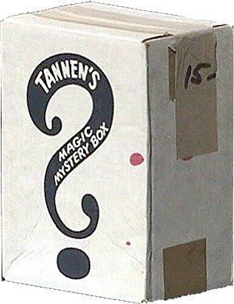

¿Qué tiene que ver la Ciencia de Datos con [J.J. Abrams](https://es.wikipedia.org/wiki/J._J._Abrams)? La respuesta es que a J.J Abrams le gustan las Cajas Negras.

En una famosa [conferencia](http://www.ted.com/talks/j_j_abrams_mystery_box)de marzo de 2007 en [TED](http://www.ted.com/), el creador de [*Perdidos*](https://es.wikipedia.org/wiki/Lost)*, [Star Trek: más allá](https://es.wikipedia.org/wiki/Star_Trek:_m%C3%A1s_all%C3%A1 "Star Trek: más allá")* o [*Star Wars: Episodio VII - El Despertar de la Fuerza*](https://es.wikipedia.org/wiki/Star_Wars:_Episode_VII_-_The_Force_Awakens "Star Wars: Episode VII - The Force Awakens")contó la siguiente historia: *siendo niño, mi abuelo me llevó a una tienda de magia llamada **Tannen's Magic**, en el Midtown de Nueva York. Perdida en las profundidades de un edificio en ruinas, se trataba de mi refugio favorito, una destartalada covacha atestada de maravillas. Siempre caía algún capricho pero lo que mi abuelo me regaló ese día me fascinaría el resto de mi vida. El objeto era una caja "mágica" de cartón de interior impenetrable y con una enorme interrogación pintada en su lateral.*

Cuarenta años después, **todavía no la ha abierto**: *Ahora representa infinitas posibilidades, representa esperanza, algo potencial*, dice Abrams. *Y **¿qué es una historia sino una caja que puede contener cualquier cosa?***

Me diréis, con razón, que la de Abrams no es una caja "negra". Cierto, no es literalmente negra. Lo que me interesa de ella es la relación que establece entre la caja - que puede contener cualquier cosa - y contar una historia.

Y es negra, siquiera conceptualmente, precisamente porque puede contener cualquier cosa.

Desde hace mucho en Teoría de Sistemas, Ingeniería y Física se utiliza el concepto de [Caja Negra](https://es.wikipedia.org/wiki/Caja_negra_(sistemas)):

> Se denomina **Caja Negra** a aquel elemento que se estudia desde el punto de vista de las entradas que recibe y las salidas o respuestas que produce, sin tener en cuenta su funcionamiento interno. En otras palabras, de una *caja negra* nos interesará su forma de interactúar con el medio que le rodea (en ocasiones, otros elementos que también podrían ser *cajas negras*) entendiendo **qué es lo que hace**, pero sin dar importancia a **cómo lo hace**.

En resumen, cuando queremos centrarnos en la historia de lo que hace un sistema sin enredarnos en los detalles de cómo lo hace, lo idealizamos como una "caja negra" de la que nos interesa qué salida produce según la entrada que recibe.

Me gustaría que visualizarais el Proceso Data Science como una Caja Negra que nos sirve para contar una historia: sí, **pregunta** y **datos** son las dos entradas de la Caja Negra Data Science; y su **salida** es l**a historia que nos cuentan los datos acerca de la pregunta que queremos responder**.

Más adelante nosotros si levantaremos la tapa para ver el interior de la Caja, los entresijos del Proceso Data Science que nos permiten convertir nuestros datos en una historia que responda a la pregunta en cuestión.

Pero de momento nos contentaremos con la Caja Negra. **¿Cómo podemos saber que la Caja está funcionando bien sin mirar en su interior?** Varias pistas:

**Primero**, pregunta y datos (las entradas) tienen que ser apropiadas. En caso contrario, se produce el famoso efecto "*garbage in, garbage out*" (dónde entra basura... saldrá basura)

*A priori* puedo intuir si la pregunta es apropiada: ¿es clara y está bien definida? ¿está orientada a la toma de decisiones y a la acción? Sin embargo hasta que no vea la salida no sabré determinar si los datos son apropiados.

**Segundo**, si la Caja funciona bien, la salida nos tiene que proporcionar alguno o varios de estos "beneficios":

Incrementar nuestro **conocimiento** (que, a medio o largo plazo, podremos convertir en acción)

Una **decisión** para poner en práctica

Un **artefacto** (informe, presentación, aplicación, cuadro de mando, en resumen, un producto basado en datos) que tangibilice alguno de los puntos anteriores.

La conclusión de que **los datos que tengo no me sirven** para responder a la pregunta.

Creo que los tres primeros son autoexplicativos. El último puede resultar "raro": ¿la Caja funciona bien si fracasamos en el intento de que nuestros datos den una respuesta a la pregunta? Yo creo que sí. No olvidemos que [la Ciencia de Datos primero es Ciencia y, sólo después Datos.](http://es100x100datascience.com/primero-la-ciencia-despues-los-datos/) Y ¿cómo avanza la Ciencia? Básica y humildemente, el Método Científico no es sino una versión sofisticada del rupestre método de "ensayo y error". Para avanzar necesitamos aprender rápido cuáles son los caminos equivocados. Cuanto antes los aprendemos menos nos costará (si, también en euros) el aprendizaje o la I+D+i.

Aunque terminemos abriendo la Caja, creo que no deberíamos perder nunca la capacidad de maravillarnos ante las historias que los datos pueden contarnos. Parafraseando a [Arthur C. Clarke](https://es.wikipedia.org/wiki/Arthur_Charles_Clarke "Arthur Charles Clarke"), "*toda tecnología lo suficientemente oculta es indistinguible de la magia*".

Al fin y al cabo, también era una Caja Negra ¿no?\[/caption\]
