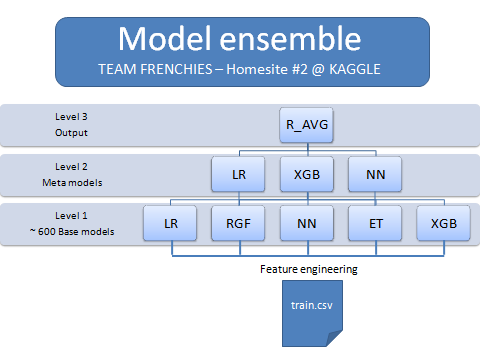

Los términos *models ensembles, stacking,* bagging o *boosting* son cada vez más comunes en el campo de la creación de modelos de aprendizaje máquina para la clasificación y la regresión*.*

En este y los próximos artículos vamos a ocuparnos de ellos. En general, cuando en aprendizaje máquina hablamos de *ensembles* nos referimos a **modelos de modelos**.

La aproximación básica para crear un modelo de clasificación o regresión es construirlo a partir de unos datos de entrenamiento (*training data*) que contienen tanto la *variable objetivo* como las *variables predictoras*. Un modelo así construido nos permite entonce *predecir* la variable objetivo a partir de las variables predictoras de cualquier otro conjunto de datos estructurado como el de entrenamiento.

Esto es lo que hemos visto, por ejemplo, en los posts *Arboles de Decisión* [I](http://es100x100datascience.com/arboles-de-decision-i/), [II](http://es100x100datascience.com/arboles-de-decision-ii/), [III](http://es100x100datascience.com/arboles-de-decision-iii/) y [IV](http://es100x100datascience.com/arboles-de-decision-iv/), en los que construimos modelos de clasificación basados en algoritmos de ese tipo para predecir la tasa de rotación de los clientes de una operadora.

Podemos dar un paso más en la construcción de modelos de aprendizaje máquina mediante la técnica conocida como ***ensemble***. Hemos dicho arriba que se trata de *modelos de modelos*: en efecto, se trata de modelos construidos no directamente a partir de los datos de un conjunto de datos de entrenamiento, sino a partir de las predicciones de **varios** modelos construidos - estos si - a partir de los datos de entrenamiento.

Es decir, primero entrenamos unos cuantos modelos tradicionales (modelos de primer nivel); y, a continuación, a partir de las predicciones de los modelos de primer nivel construimos un segundo modelo (modelo de segundo nivel). Normalmente paramos ahí, pero podríamos continuar creando nuevos niveles de modelos.

Lo que estamos intentando con esto es construir un modelo "fuerte" a partir de otros modelos más "débiles". Es una estrategia de juego en equipo: si logramos conjuntar el "juego" de varios modelos, quizá podamos construir un equipo más "fuerte" que cualquiera de sus componentes.

Claro, para conseguir esto los componentes "débiles" deben estar especializados en diferentes cosas (por ejemplo, unos serán defensas, otros delanteros y otros centrocampistas; todos deben ser "buenos" en lo suyo aunque ninguno sea bueno "en todo") todas ellas necesarias para que el equipo así obtenido sea más potente que sus componentes por separado. Esto último significa que los modelos que compongan el *ensemble* deben ser distintos entre sí (baja correlación entre sus predicciones).

Por ejemplo, podríamos utilizar, como modelos de primer nivel, un *random forest*, una *máquina de vector soporte* y un *extreme gradient boosting*; y, como modelo de segundo nivel, una *red neuronal (*por cierto, excepto el SVM, los demás modelos mencionados son *ensembles* internamente*)*.

Caben todo tipo de aproximaciones: podría haber muchos más modelos en el primer nivel, incluso del mismo tipo pero con diferentes parámetros. Y el modelo de segundo nivel podría ser tan sencillo como una **media**, una **media ponderada** o un **recuento** tipo "votación en la que la mayoría gana" de las predicciones de los modelos de primer nivel. Si el *ensemble* utiliza como modelo de segundo nivel uno complejo, basado en un algoritmo de aprendizaje máquina como *random forest*, *redes neuronales*, *support vector machines*, etc., entonces se denomina **stack** ("pila") de modelos, y la técnica asociada se denomina **stacking**.

Entre los incontables tipos de *ensembles* hay que destacar también dos técnicas avanzadas, el *bagging* y el *boosting*. Más adelante, en otros posts, hablaremos de ellas.

Los *ensembles* suelen mejorar el rendimiento de los modelos de primer nivel, sobre todo si el de estos últimos no es espectacular.Pero debemos tener en cuenta las dos condiciones que hemos sugerido arriba: que los modelos que los forman cumplan un **mínimo de rendimiento** en cuanto a los criterios que definamos y que sus predicciones estén **lo menos correladas que sea posible**.

Como ejemplo, en los siguientes artículos vamos a construir algunos ensembles para el mismo problema de predicción de la tasa de rotación de clientes de una operadora que tratamos en la serie *Arboles de Decisión*. [I](http://es100x100datascience.com/arboles-de-decision-i/), [II](http://es100x100datascience.com/arboles-de-decision-ii/), [III](http://es100x100datascience.com/arboles-de-decision-iii/) y [IV](http://es100x100datascience.com/arboles-de-decision-iv/)
